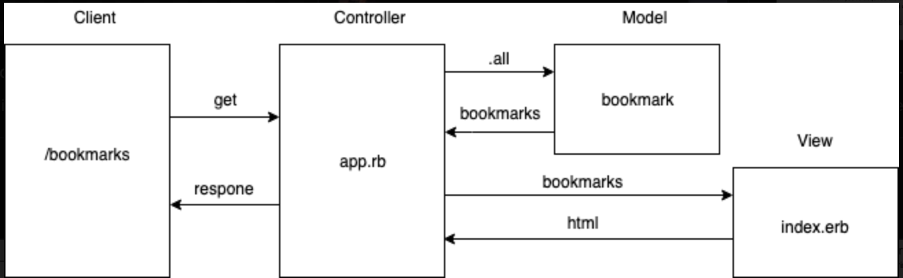

## Bookmark Manager

Week 4 pairing project. Instructions can be found [here](https://github.com/makersacademy/course/blob/master/bookmark_manager/00_challenge_map.md)

### User Stories
```
As a user,<br>
I would like to save and see my list of bookmarks.
```
```
As a user, <br>
I would like to add and delete bookmarks <br>
so that I can update bookmarks <br>
```



Anyone needing to setup the database from scratch will need to do the following things:
1. Connect to psql
2. Create the database using the psql command CREATE DATABASE bookmark_manager;
3. Create the database bookmark_manager_test
4. Connect to the database using the pqsl command \c bookmark_manager;
5. Connect to the database bookmark_manager_test
4. Run the query we have saved in the file 01_create_bookmarks_table.sql
